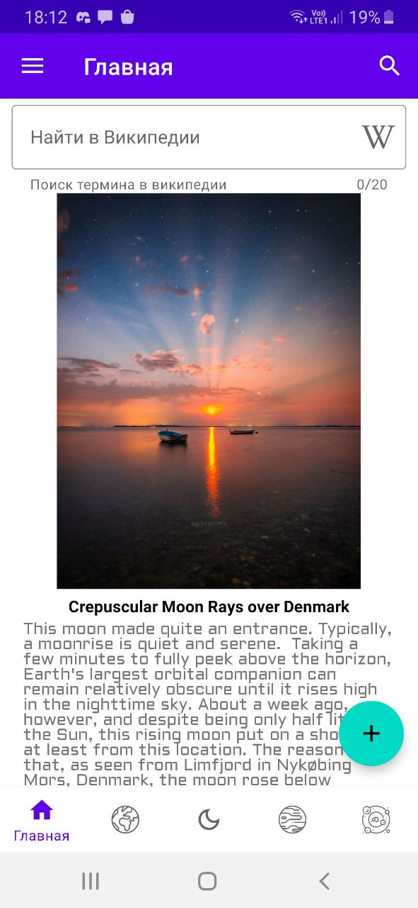
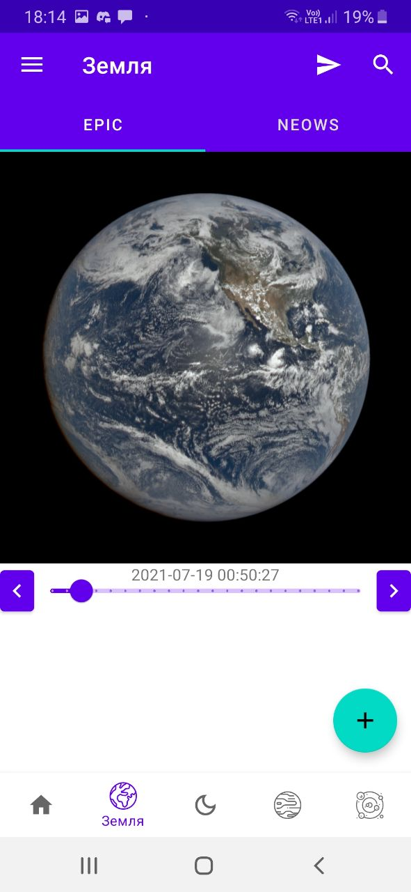
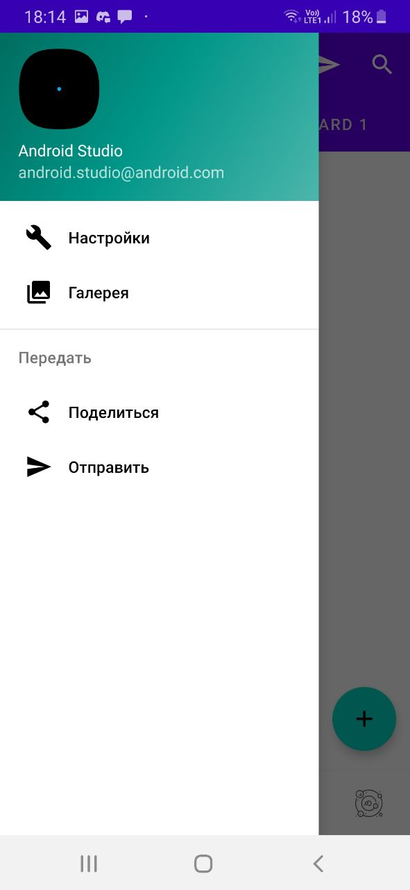

Pale Blue Dot – приложение демонстрирующее реализацию
компонентов Material Design. Приложение использует NASA APIs и
использует различные компоненты Material Design (Bottom navigation,
Navigation drawer, Tabs..)

  
  
  

